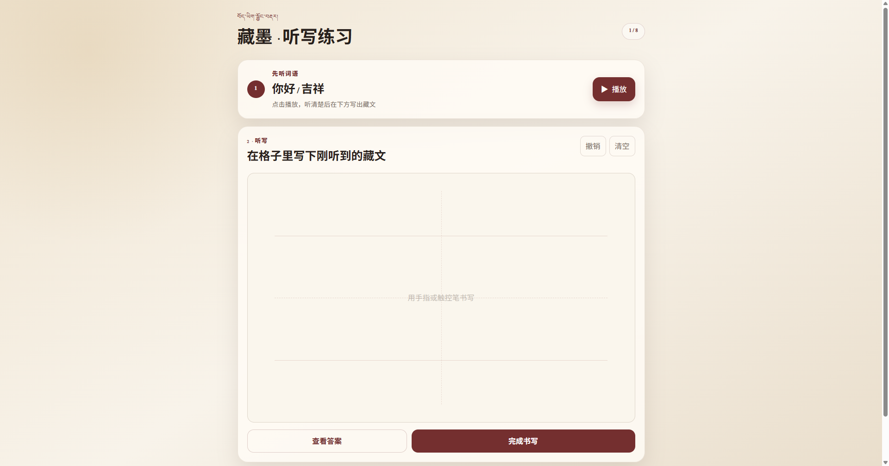

# 藏墨【藏文听写软件】 Windows 桌面版
<table>
  <tr>
    <td width="50%" align="center">
      
    </td>
  </tr>
  <tr>
    <td align="center"><strong> </strong>藏文听写软件</td>

  </tr>
</table>
运行方法：
1. 打开“藏墨-Windows-x64”文件夹。
2. 双击“藏墨.exe”。
3. 程序内的8个藏语音频均可离线播放。

分发方法：
请把整个“藏墨-Windows-x64”文件夹复制或压缩后发送给其他人，不能只单独发送“藏墨.exe”，因为旁边的 DLL、resources 和 locales 文件也是程序运行所必需的。

系统要求：
- Windows 10 或 Windows 11 64位
- 建议使用触摸屏、手写笔或鼠标进行书写

提示：
当前版本没有数字签名，Windows 首次打开时可能显示安全提醒。请选择“更多信息”后再选择“仍要运行”。

